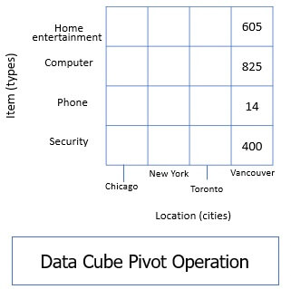

# Cube
[Google](https://binaryterms.com/data-cube.html)
- Multi-dimensional structure data storage
- )
- Stores the precomputed data and eases online analytical processing (OLAP).
- Data representation: Dimensions and Facts
- Dimensions: attitude, angle or the entities with respect to which the enterprise wants to store the data
- Fact: Numeric measures
- Basic Category: Multi-dimensional Data Cube (MOLAP); Relational Data Cube (ROLAP); Hybrid Data Cube (HOLAP)
- Operation on Data Cube:
    * **Roll Up:** summarizes or aggregates the dimensions either by performing dimension reduction or you can perform concept hierarchy.
    * )
    * **Drill Down:** fragmenting into granular form
    * 
    * **Slice and Dice:** pick up one dimension of the data cube and then forms a sub-cube out of it.
    * 